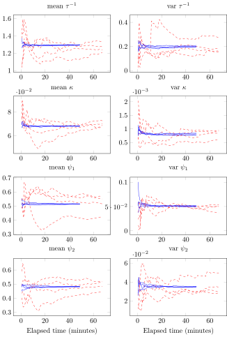

# ReverseDiffDSGE

This package provides a reverse mode derivative for linearised rational expectations
(DSGE) models.
This reverse mode derivative can be used to enable the estimation of linearised rational
expectations models using derivative based samplers (e.g. NUTS, and Hamiltonian Monte Carlo).
The package uses reverse mode differentiation to efficiently calculate
gradients of the likelihood function with respect to the underlying model
parameters.

An example model is provided, based on Herbst and Schorfheide,
"Bayesian Estimation of DSGE Models" (2016, Ch 2.1).

The contribution of this work is to derive the pullback provided in `src/functions/blanchardkahn.jl`,
which should be straightforward to translate into other programming languages.

This package should not be considered a toolbox.

Please cite

Duncan, Alfred (2021) "Reverse Mode Differentiation for DSGE Models,"
University of Kent Discussion Paper Series.

## Why use derivative based samplers?

The following image shows the mean and variance of posterior distributions
for MCMC chains generated by NUTS (blue, solid, \(1 \times 10^4\) iters per chain)
and Metropolis Hastings (red, dashed, \(1.5 \times 10^6\) iters per chain)
for the small scale New Keynesian model described by Herbst and Schorfheide (2016).

